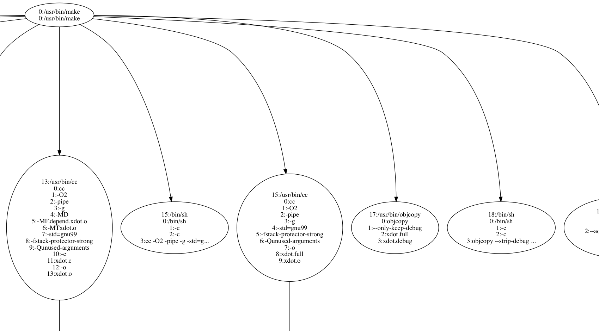

# x-trace
FreeBSD 11+12 kernel hacking example : x-trace, simple tool to trace execution

Description
--------------

This is a simple example of FreeBSD 11 kernel hacking. It comes with a driver (sys/), a userland program that communicates with the driver (bin/xtrace) and two tools (bin/xdump, bin/xdot) to dump the content of the binary file created by xtrace.

How to install
--------------

	# git clone https://github.com/xigh/x-trace
	# cd x-trace
	# make

How to use it
--------------

Load the kernel module:

	# kldload sys/xtrace.ko

Trace the execution of /bin/ls:

	# bin/xtrace/xtrace /bin/ls
	started pid 4467
	Makefile	bin		sys		xtrace.out
	child returned with 0

Dump the file generated by xtrace:

	# bin/xdump/xdump xtrace.out 
	 4466: fork pid=4467
	  4467: exec '/bin/ls' argc=1 envc=24
		argv:
		   0: /bin/ls
		envv:
		   0: e
		   1: bin/xtSHELL=/bin/csh
		   2: SSH_CLIENT=2a01:....
		   3: LOGNAME=xigh
		   4: PAGER=more
		   5: MAIL=/var/mail/xigh
		   6: PATH=/sbin:/bin:/usr/sbin:/usr/bin:/usr/local/sbin:...
		   7: EDITOR=vi
		   8: ENV=/home/xigh/.shrc
		   9: OLDPWD=/usr/home/xigh/src
		  10: PWD=/usr/home/xigh/src/xtrace
		  11: TERM=xterm-256color
		  12: SSH_TTY=/dev/pts/1
		  13: HOME=/root
		  14: USER=xigh
		  15: SSH_CONNECTION=2a01:....
		  16: BLOCKSIZE=K
		  17: HOSTTYPE=FreeBSD
		  18: VENDOR=amd
		  19: OSTYPE=FreeBSD
		  20: MACHTYPE=x86_64
		  21: SHLVL=1
		  22: GROUP=wheel
		  23: HOST=fbsd11
	 4467: exit rval=0

Or use the new xexec tool I created:

	# bin/xexec/xexec xtrace.out
	?:/bin/sh
		?:/usr/bin/make
		/usr/home/xigh/src/x-trace:/bin/sh "-c" "cc --version || echo 0.0.0"
			/usr/home/xigh/src/x-trace:/usr/bin/cc "--version"
		/usr/home/xigh/src/x-trace:/bin/sh "-c" "echo \"6.0.1 6.0.1)\" | awk -F. '{print $1 * 10000 + $2 * 100 + $3;}'"
			/usr/home/xigh/src/x-trace:/usr/bin/awk "-F." "{print $1 * 10000 + $2 * 100 + $3;}"
		/usr/home/xigh/src/x-trace:/bin/sh "-c" "{ echo \"__FreeBSD_cc_version\" | cc -E - 2>/dev/null || echo __FreeBSD_cc_version; } | sed -n '$p'"
			/usr/home/xigh/src/x-trace:/usr/bin/sed "-n" "$p"
			/usr/home/xigh/src/x-trace:/usr/bin/cc "-E" "-"
				/usr/home/xigh/src/x-trace:/usr/bin/cc "-cc1" "-triple" "x86_64-unknown-freebsd12.0" "-E" "-disable-free" "-disable-llvm-verifier" "-discard-value-names" "-main-file-name" "-" "-mrelocation-model" "static" "-mthread-model" "posix" "-mdisable-fp-elim" "-masm-verbose" "-mconstructor-aliases" "-munwind-tables" "-fuse-init-array" "-target-cpu" "x86-64" "-dwarf-column-info" "-debugger-tuning=gdb" "-resource-dir" "/usr/lib/clang/6.0.1" "-fdebug-compilation-dir" "/usr/home/xigh/src/x-trace" "-ferror-limit" "19" "-fmessage-length" "0" "-fobjc-runtime=gnustep" "-fdiagnostics-show-option" "-o" "-" "-x" "c" "-"
		/usr/home/xigh/src/x-trace:/bin/sh "-c" "(ld --version || echo none) | sed -n 1p"
			/usr/home/xigh/src/x-trace:/usr/bin/ld "--version"
	...

Create a graphviz representation of the trace:

	# bin/xdot/xdot xtrace.out
	digraph G {
		"0:/usr/bin/make\n0:/usr/bin/make\n" -> "1:/bin/sh\n0:sh\n1:-c\n2:cc --version || echo 0...\n"
		"1:/bin/sh\n0:sh\n1:-c\n2:cc --version || echo 0...\n" -> "2:/usr/bin/cc\n0:cc\n1:--version\n"
		"0:/usr/bin/make\n0:/usr/bin/make\n" -> "3:/bin/sh\n0:sh\n1:-c\n2:echo '3.8.0 3.8.0)' | ...\n"
		"3:/bin/sh\n0:sh\n1:-c\n2:echo '3.8.0 3.8.0)' | ...\n" -> "5:/usr/bin/awk\n0:awk\n1:-F.\n2:{print $1 * 10000 + $2...\n"
		"0:/usr/bin/make\n0:/usr/bin/make\n" -> "6:/bin/sh\n0:sh\n1:-c\n2:{ echo '__FreeBSD_cc_v...\n"
		"6:/bin/sh\n0:sh\n1:-c\n2:{ echo '__FreeBSD_cc_v...\n" -> "8:/usr/bin/sed\n0:sed\n1:-n\n2:$p\n"
		"10:/usr/bin/cc\n0:cc\n1:-E\n2:-\n" -> "11:/usr/bin/cc\n0:/usr/bin/cc\n1:-cc1\n2:-triple\n3:x86_64-unknown-freebsd...\n4:-E\n5:-disable-free\n6:-disable-llvm-verifier\n7:-main-file-name\n8:-\n9:-mrelocation-model\n10:static\n11:-mthread-model\n12:posix\n13:-mdisable-fp-elim\n14:-masm-verbose\n15:-mconstructor-aliases\n16:-munwind-tables\n17:-target-cpu\n18:x86-64\n19:-dwarf-column-info\n20:-debugger-tuning=gdb\n21:-resource-dir\n22:/usr/bin/../lib/clang/...\n23:-fdebug-compilation-dir\n24:/usr/home/xigh/src/xtrace\n25:-ferror-limit\n26:19\n27:-fmessage-length\n28:0\n29:-fobjc-runtime=gnustep\n30:-fdiagnostics-show-option\n31:-o\n32:-\n33:-x\n34:c\n35:-\n"
		"0:/usr/bin/make\n0:/usr/bin/make\n" -> "12:/bin/sh\n0:/bin/sh\n1:-e\n2:-c\n3:target=all;  for dir i...\n"
		"12:/bin/sh\n0:/bin/sh\n1:-e\n2:-c\n3:target=all;  for dir i...\n" -> "13:/usr/bin/make\n0:/usr/bin/make\n1:all\n2:DIRPRFX=sys/\n"
		"13:/usr/bin/make\n0:/usr/bin/make\n1:all\n2:DIRPRFX=sys/\n" -> "14:/bin/sh\n0:sh\n1:-c\n2:find /usr/src/sys/ -na...\n"
		"13:/usr/bin/make\n0:/usr/bin/make\n1:all\n2:DIRPRFX=sys/\n" -> "14:/usr/bin/find\n0:find\n1:/usr/src/sys/\n2:-name\n3:*_if.m\n"
		"13:/usr/bin/make\n0:/usr/bin/make\n1:all\n2:DIRPRFX=sys/\n" -> "15:/bin/sh\n0:/bin/sh\n1:-e\n2:-c\n3:echo 'Warning: Object ...\n"
		"12:/bin/sh\n0:/bin/sh\n1:-e\n2:-c\n3:target=all;  for dir i...\n" -> "16:/usr/bin/make\n0:/usr/bin/make\n1:all\n2:DIRPRFX=bin/\n"
		"16:/usr/bin/make\n0:/usr/bin/make\n1:all\n2:DIRPRFX=bin/\n" -> "17:/bin/sh\n0:/bin/sh\n1:-e\n2:-c\n3:target=all;  for dir i...\n"
		"17:/bin/sh\n0:/bin/sh\n1:-e\n2:-c\n3:target=all;  for dir i...\n" -> "18:/usr/bin/make\n0:/usr/bin/make\n1:all\n2:DIRPRFX=bin/xtrace/\n"
		"18:/usr/bin/make\n0:/usr/bin/make\n1:all\n2:DIRPRFX=bin/xtrace/\n" -> "19:/bin/sh\n0:/bin/sh\n1:-e\n2:-c\n3:echo 'Warning: Object ...\n"
		"17:/bin/sh\n0:/bin/sh\n1:-e\n2:-c\n3:target=all;  for dir i...\n" -> "20:/usr/bin/make\n0:/usr/bin/make\n1:all\n2:DIRPRFX=bin/xdump/\n"
		"20:/usr/bin/make\n0:/usr/bin/make\n1:all\n2:DIRPRFX=bin/xdump/\n" -> "21:/bin/sh\n0:/bin/sh\n1:-e\n2:-c\n3:echo 'Warning: Object ...\n"
		"17:/bin/sh\n0:/bin/sh\n1:-e\n2:-c\n3:target=all;  for dir i...\n" -> "22:/usr/bin/make\n0:/usr/bin/make\n1:all\n2:DIRPRFX=bin/xdot/\n"
		"22:/usr/bin/make\n0:/usr/bin/make\n1:all\n2:DIRPRFX=bin/xdot/\n" -> "23:/bin/sh\n0:/bin/sh\n1:-e\n2:-c\n3:echo 'Warning: Object ...\n"
	}
		

How it works
--------------

When the kernel module loads, it install hooks on a few syscalls:

	cb_fork = sysent[SYS_fork].sy_call;
	sysent[SYS_fork].sy_call =  &xtrace_fork;
	cb_vfork = sysent[SYS_vfork].sy_call;
	sysent[SYS_vfork].sy_call =  &xtrace_vfork;
	cb_exit = sysent[SYS_exit].sy_call;
	sysent[SYS_exit].sy_call =  &xtrace_exit;
	cb_exec = sysent[SYS_execve].sy_call;
	sysent[SYS_execve].sy_call =  &xtrace_exec;
	cb_chdir = sysent[SYS_chdir].sy_call;
	sysent[SYS_chdir].sy_call = &xtrace_chdir;

Then call the original syscall:

	static sy_call_t *cb_exit = 0;
	static int xtrace_exit(struct thread *td, void *uap) {
	       return cb_exit(td, uap);
	}

Licence
--------------

   Copyright (c) 2013-2019 Philippe Anel. All rights reserved.
  
   Redistribution and use in source and binary forms, with or without
   modification, are permitted provided that the following conditions
   are met:
   1. Redistributions of source code must retain the above copyright
      notice, this list of conditions and the following disclaimer.
   2. Redistributions in binary form must reproduce the above copyright
      notice, this list of conditions and the following disclaimer in the
      documentation and/or other materials provided with the distribution.
   4. Neither the name of the University nor the names of its contributors
      may be used to endorse or promote products derived from this software
      without specific prior written permission.
  
   THIS SOFTWARE IS PROVIDED BY THE REGENTS AND CONTRIBUTORS ``AS IS'' AND
   ANY EXPRESS OR IMPLIED WARRANTIES, INCLUDING, BUT NOT LIMITED TO, THE
   IMPLIED WARRANTIES OF MERCHANTABILITY AND FITNESS FOR A PARTICULAR PURPOSE
   ARE DISCLAIMED.  IN NO EVENT SHALL THE REGENTS OR CONTRIBUTORS BE LIABLE
   FOR ANY DIRECT, INDIRECT, INCIDENTAL, SPECIAL, EXEMPLARY, OR CONSEQUENTIAL
   DAMAGES (INCLUDING, BUT NOT LIMITED TO, PROCUREMENT OF SUBSTITUTE GOODS
   OR SERVICES; LOSS OF USE, DATA, OR PROFITS; OR BUSINESS INTERRUPTION)
   HOWEVER CAUSED AND ON ANY THEORY OF LIABILITY, WHETHER IN CONTRACT, STRICT
   LIABILITY, OR TORT (INCLUDING NEGLIGENCE OR OTHERWISE) ARISING IN ANY WAY
   OUT OF THE USE OF THIS SOFTWARE, EVEN IF ADVISED OF THE POSSIBILITY OF
   SUCH DAMAGE.
